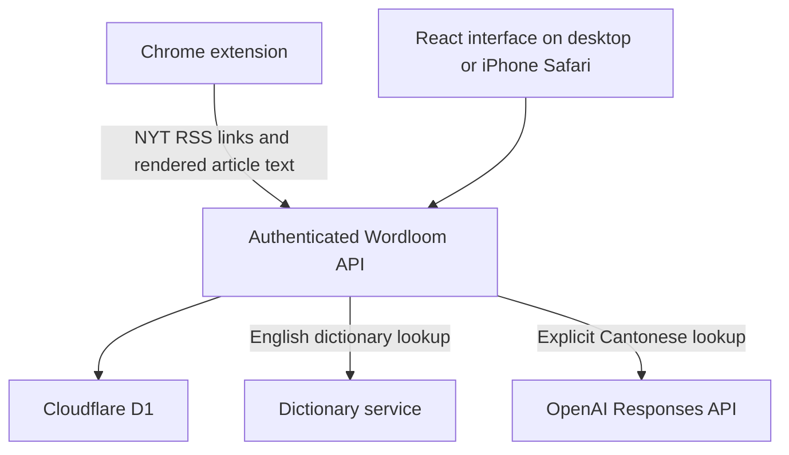

# Wordloom — Read & remember

A personal vocabulary trainer built to turn daily New York Times reading into lasting vocabulary practice, with Cantonese explanations for a Hong Kong learner preparing for IELTS.

This is the **hosted web version**, including the Chrome daily importer and standalone spelling test. It is separate from the later Windows `wordloom-mobile` / Capacitor prototype.

## What it does

- **NYT reading shelf:** import article text you can access, show the latest 20 articles by date, and mark articles as read when opened. Older records remain stored.
- **Daily Chrome import:** an extension tries to import up to five new articles across technology, business, world, science and culture at 8 am Australia/Sydney.
- **Vocabulary notebook:** tap unfamiliar English words, keep the surrounding sentence, look up an English definition and save an editable Cantonese explanation.
- **Spelling test:** practise up to 10 words with saved meanings, earliest review dates first. Type from English/Cantonese clues, check answers, skip unfamiliar words and see a session score.
- **Five-part lessons:** meaning recall, spelling, sentence gaps, speaking/self-recording and writing a personal example.
- **Review scheduling:** incorrect/skipped answers return after about 10 minutes; successful reviews advance through 1, 3, 7, 14, 30 and 60 day intervals.
- **Private hosted access:** notebook and reading records are scoped to the authenticated owner.

Spelling practice reuses saved explanations and makes no AI requests. New Cantonese explanations use a server-side OpenAI key and may incur API charges. This snapshot does **not** include the separate mobile prototype's 30-per-day translation quota.

## Architecture



The live web app uses **React, TypeScript, Vinext/Vite, Cloudflare Workers and D1**. `backend/` contains a separate **FastAPI + SQLite** service and tests for a possible migration; including Python in this repository does not mean the live app is Python-backed. No production Python cutover is part of this release.

## Repository map

| Path | Purpose |
| --- | --- |
| `app/page.tsx` | Reading, notebook and practice navigation |
| `app/imported-articles.tsx` | Article import, dates and read state |
| `app/spelling-test.tsx` | Standalone spelling session |
| `app/practice.tsx` | Five-part lesson |
| `app/speaking.tsx` | Speech playback and optional local recording |
| `app/api/` | Authenticated hosted API routes |
| `lib/practice.ts` | Answer comparison and review scheduling helpers |
| `lib/cantonese.ts` | Server-side Cantonese generation |
| `db/`, `drizzle/` | D1 schema and migrations |
| `extension/wordloom-importer/` | Chrome extension source |
| `extension/tests/` | Extraction and scheduling checks |
| `backend/` | Optional Python backend, tests and migration notes |

## Using the Chrome importer

1. In desktop Chrome, open `chrome://extensions`, enable Developer mode, and load `extension/wordloom-importer/` with **Load unpacked**.
2. Sign in to NYT and your Wordloom site in the same Chrome profile.
3. Open the extension popup, grant the requested site permissions and choose **Enable daily import**.
4. Keep the laptop awake with Chrome running around 8 am Sydney time. Browser alarms may run late; a missed run catches up for the current day when Chrome resumes.
5. Read the imported articles on your iPhone/iPad using the same Wordloom account.

The extension is configured for the original Wordloom domain. For your own deployment, update that origin in its manifest and scripts, rebuild the downloadable ZIP, and reload the extension. See [extension instructions](extension/wordloom-importer/README.txt).

RSS supplies article links, not full text. The extension reads visible article paragraphs through the user's normal NYT browser session. Login prompts, verification pages and other failures stop the run. It does not bypass access restrictions. Extraction is experimental: compare article endings with the original, especially for interactive pages and live blogs. This repository contains no imported NYT article dataset, cookies or subscriber credentials.

## Development

### Frontend and hosted API

Requirements: Node.js 22.13 or newer and pnpm matching the `packageManager` version in `package.json`.

```sh
pnpm install --frozen-lockfile
pnpm exec tsc --noEmit
pnpm dev
```

The development script uses port 5173 in its portable profile. Build with `pnpm build`.

**Runtime setup is required for working private APIs.** This is a snapshot of a Sites-hosted application, not a fully standalone `npm start` deployment. Production requires trusted platform authentication, a D1 binding named `DB`, and the migrations in `drizzle/`. `.openai/hosting.json` retains logical bindings but omits the original site's project ID; register your own Site before publishing. Cloning this code does not grant access to the original deployment or its database.

The API trusts identity headers supplied by the hosting authentication layer. Do not expose these routes on an unprotected server that accepts caller-supplied identity headers. A different host needs its own verified authentication integration.

Optional configuration names are listed in `.env.example`. Configure `OPENAI_API_KEY` as a server-side secret in the host, never as a browser environment variable. The hosted Cantonese endpoint uses `gpt-4.1-mini`. Keep `PYTHON_BACKEND_URL` and `PYTHON_BACKEND_TOKEN` unset unless you have completed a separate verified migration.

### Optional Python service (Windows PowerShell)

```powershell
cd backend
python -m venv .venv
.\.venv\Scripts\python.exe -m pip install -r requirements-dev.txt
$env:WORDLOOM_SERVICE_TOKEN = python -c "import secrets; print(secrets.token_urlsafe(32))"
$env:WORDLOOM_DB_PATH = ".\data\wordloom.db"
.\.venv\Scripts\python.exe -m uvicorn app.main:app --host 127.0.0.1 --port 8000
```

This service uses a server-to-server token and a trusted user header; it is not a browser login system. Its API is not identical to the newer `wordloom-mobile` project. See [backend setup and migration limitations](backend/README.md), including article migration requirements below.

### Checks

```sh
node --test extension/tests/*.test.mjs
```

From `backend/`, after installing development dependencies:

```sh
python -m pytest -q tests
```

Automated checks cover extraction fixtures, scheduling and Python API behaviour. They cannot guarantee NYT access or page compatibility. Real import availability depends on the user's browser session.

## Learning design and limits

- Spelling comparison ignores case, outer whitespace and selected Unicode punctuation variations; it does not accept arbitrary synonyms or plural forms.
- The standalone test's score is shown for that session. Review dates are saved; a permanent history of test scores is not implemented.
- Sentence exercises check target-word inclusion and basic length. Grammar and meaning are self-assessed.
- Speaking uses browser speech/audio features and self-assessment, not automatic pronunciation scoring.
- The daily importer runs on the laptop, not on a cloud schedule or directly on iPhone.
- This is a mobile-friendly website, not an App Store app.
- Original practice content remains in legacy source fixtures, but the active reading shelf uses imported NYT articles.

## Portfolio context

Built by Nicholas Tang as an AI-assisted personal learning project. The project combines browser automation, contextual vocabulary capture, Cantonese explanations, persistent review scheduling and responsive UI development. The code and documentation distinguish the deployed implementation from experimental and optional components.

The source snapshot excludes environment secrets, browser sessions, local databases, imported articles, build output and the private development Git history. Third-party notices are retained in `build/` and `vendor/`.
