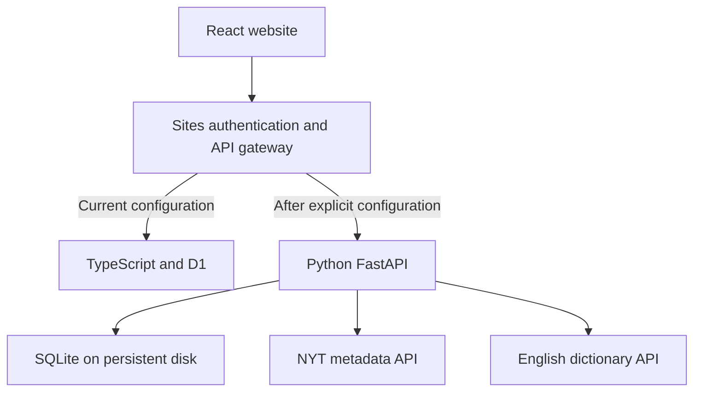

# Wordloom Python backend

This is a runnable Python/FastAPI replacement for Wordloom's notebook, lesson-progress, word-lookup and article-discovery APIs. The React interface keeps its existing request formats.

**Deployment status:** the published Site still uses its original TypeScript/D1 backend. Python has been implemented and tested locally, but no Python host or production connection has been configured. No NYT API key is included. The NYT connector returns links and summaries, not full article text.

## Run locally (Windows PowerShell)

From the `backend` folder:

```powershell
python -m venv .venv
.\.venv\Scripts\Activate.ps1
python -m pip install -r requirements-dev.txt
$env:WORDLOOM_SERVICE_TOKEN = python -c "import secrets; print(secrets.token_urlsafe(32))"
$env:WORDLOOM_DB_PATH = ".\data\wordloom.db"
python -m uvicorn app.main:app --host 127.0.0.1 --port 8000
```

Open `http://127.0.0.1:8000/docs` for the API documentation. `/health` is public; every `/api/*` endpoint requires a service bearer token and `X-Wordloom-User`. These are server-to-server credentials, not an end-user sign-in system.

Run tests with `python -m pytest -q tests` from this folder. Dependencies are pinned to the versions tested here.

## Architecture and authentication



The browser never receives the service token. The Sites gateway gets the signed-in user from platform authentication, then forwards the verified ID and a service token over HTTPS. Python rejects calls without both. Every notebook read/write includes the owner key. The Python API is not intended to accept untrusted clients that know the service token.

Setting `PYTHON_BACKEND_URL` enables forwarding. If Python is configured but fails, requests return an error: the gateway does not silently write to the old database. This prevents two divergent notebooks. When the URL is unset, the existing Site uses D1 as before.

## Deploy and switch over

1. Deploy this container on a Python-capable host with a persistent disk, HTTPS, and a random service secret. A single server can use SQLite; this is not configured for multi-instance storage. Back up the SQLite database using its backup API.
2. Copy `.env.example` to `.env` when using Docker Compose. Supply your service secret and optional NYT developer API key. `docker compose up --build -d` uses a named persistent volume and listens on localhost; an HTTPS reverse proxy is still required for hosted access.
3. Before cutover, pause notebook edits and export each user's current `/api/words` response through their authenticated session. POST that JSON array to Python's `/api/import` using the service credential and the exact existing user ID. It preserves IDs, due dates, review stages, sentences and progress; repeated imports do not overwrite records.
4. Compare all imported records with the export. Do not enable the proxy until the migration is verified.
5. Set `PYTHON_BACKEND_URL` (HTTPS origin) and `PYTHON_BACKEND_TOKEN` as private hosted Site settings, then publish. The token must match Python's `WORDLOOM_SERVICE_TOKEN`.
6. Verify saving a word, reloading the notebook and finishing a lesson. If rolling back after Python has received writes, reconcile those writes first; simply unsetting the URL would expose the old D1 snapshot.

This deployment has not been performed. Do not describe the current live Site as Python-backed yet. The bundled Dockerfile has not been built in this workspace.

SQLite on a local file is **not suitable for Lambda's temporary filesystem**. Before choosing Lambda, replace storage with an appropriate durable service. The existing Site hosting pipeline only deploys the frontend/gateway; it does not deploy this Python directory.

## NYT article discovery

Set `NYT_API_KEY` on the Python server to a developer key with Top Stories access. A reader subscription is separate from this developer credential.

`GET /api/articles` fetches the Top Stories home feed, selects up to five distinct sections, validates NYT link domains, and caches the result by UTC calendar day. Refresh happens when the endpoint is first requested each day; there is no background scheduled job. Fewer than five picks can be returned if the source lacks five sections.

Each item contains a title, summary, category and a link to NYT. The site displays the items only after the Python connection is active. Full text, images, login cookies and subscription sessions are not fetched or stored. The API integration was tested with fixtures, not a live NYT key. A supported full-text source remains a separate requirement for an in-app NYT reader.

References: [NYT Top Stories documentation](https://developer.nytimes.com/docs/top-stories-product/1/overview), [NYT terms](https://help.nytimes.com/hc/en-us/articles/115014893428-Terms-of-Service), [Free Dictionary API](https://dictionaryapi.dev/).

## What is and is not assessed

Python stores lesson checkpoints and computes the next review date. Spelling and simple target-word checks still run in the React lesson interface. Speaking uses browser audio and self-assessment; sentence meaning and grammar are also self-assessed. No AI grading, automatic full-text translation or speech-scoring service is connected.

## Hosted web snapshot notes (September 2026)

The hosted web version also includes a Chrome extension for daily full-text import from readable NYT tabs. This is independent of the Python metadata connector described above. See the root README and `extension/wordloom-importer/README.txt`.

The TypeScript reading API has since added latest-20 selection and read-state updates. This Python service does not yet implement the complete current reading contract (including `PATCH /api/reading`). Do not switch the current hosted app to Python without aligning that contract and migrating both words and articles. The existing word import endpoint is not a full-site migration tool.
